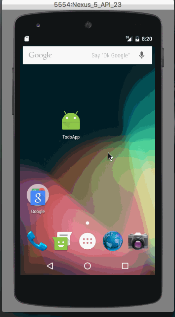

# Pre-work - *todoApp*

**todoApp** is a simple android app that can add, remove and update items. 

Submitted by: **Dipen Rana**

Time spent: **8** hours spent in total

## User Stories

The following **required** functionality is completed:

* [x] User can **successfully add and remove items** from the todo list
* [x] User can **tap a todo item in the list and bring up an edit screen for the todo item** and then have any changes to the text reflected in the todo list.
* [x] User can **persist todo items** and retrieve them properly on app restart

The following **additional** features are implemented:

* [x] The Add new item button is disabled if no text is entered into edit text box.
* [x] Ability to go back to main screen from edit item screen.

## Video Walkthrough 

Here's a walkthrough of implemented user stories:

`
GIF created with [LiceCap](http://www.cockos.com/licecap/).

## Notes

1. I was unable to bring up the keyboard on edit screen by itself. User has to click on edit text box to bring up the keyboard. I am 
   missing something in setting the focus of the edit text field. 
2. I had to look for help to add empty text watcher for edit text box. 

## License

    Copyright [2016] [Dipen Rana]

    Licensed under the Apache License, Version 2.0 (the "License");
    you may not use this file except in compliance with the License.
    You may obtain a copy of the License at

        http://www.apache.org/licenses/LICENSE-2.0

    Unless required by applicable law or agreed to in writing, software
    distributed under the License is distributed on an "AS IS" BASIS,
    WITHOUT WARRANTIES OR CONDITIONS OF ANY KIND, either express or implied.
    See the License for the specific language governing permissions and
    limitations under the License.
